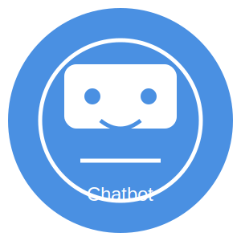

# Chatbot-Python
---
[In Python GUI](https://github.com/mdriyadkhan585/Chatbot-GUI)

[In C script](https://github.com/mdriyadkhan585/Chatbot-in-C)




---
Welcome to the **Advanced Chatbot** project! This chatbot, written in Python, offers a fun and interactive command-line experience. It's designed to showcase basic conversational abilities and demonstrate how Python can handle simple AI tasks.

## 📋 Table of Contents
- [Introduction](#introduction)
- [Features](#features)
- [Prerequisites](#prerequisites)
- [Installation](#installation)
- [Usage](#usage)
- [How It Works](#how-it-works)
- [Customization](#customization)

## 💡 Introduction

This Python chatbot can respond to a variety of user inputs, providing a simple yet engaging interactive experience. With support for emojis, it makes conversations more lively and enjoyable. Perfect for learning about chatbot logic and Python programming!

## ✨ Features

- **Interactive Conversations**: Responds to various user inputs with engaging replies.
- **Date and Time**: Provides current date and time.
- **Emoji Integration**: Uses emojis to make interactions more expressive and fun.
- **Customizable**: Easily extendable with additional queries and responses.

## 🛠️ Prerequisites

Before you begin, ensure you have:

- **Python 3.x**: The script is compatible with Python 3.x. Download and install it from [Python's official website](https://www.python.org/downloads/).
- **`emoji` Library**: Install it using pip for emoji support.
  ```bash
  pip install emoji
  ```

## 📥 Installation

Follow these steps to get the chatbot running on your machine:

1. **Clone the Repository**:
   ```bash
   git clone https://github.com/mdriyadkhan585/Chatbot-Python.git
   ```

2. **Navigate to the Project Directory**:
   ```bash
   cd Chatbot-Python
   ```

3. **Install Dependencies**:
   ```bash
   pip install emoji
   ```

## ▶️ Usage

Run the chatbot script using Python to start interacting:

```bash
python chatbot.py
```

### 🎮 Interacting with the Chatbot

- **Greet the Bot**: Type `hello` and press Enter.
- **Ask How the Bot Is**: Type `how are you`.
- **Ask for Its Name**: Type `what's your name`.
- **Inquire About Its Abilities**: Type `what can you do`.
- **Request the Time**: Type `what's the time`.
- **Request the Date**: Type `what's the date`.
- **Tell a Joke**: Type `tell me a joke`.
- **Ask About Weather**: Type `what is the weather like`.
- **Ask Favorite Things**: Type `what is your favorite color` or `what is your favorite food`.
- **Say Goodbye**: Type `bye` to end the chat.

Example Interaction:

```plaintext
========================================
       Welcome to the Chatbot!          🤖
========================================

Chatbot: Hello! I'm your virtual assistant. Type 'bye' to exit. 👋

You: hello

Chatbot: Hi there! How can I assist you today? 👋

You: what's the time

Chatbot: The current time is 14:23:45 ⏰

You: bye

Chatbot: Goodbye! Have a fantastic day! 👋
========================================
       Thank you for chatting!          🎉
========================================
```

## ⚙️ How It Works

The chatbot listens for user input, processes it, and responds based on predefined queries. Key elements include:

- **`respond()` Function**: Handles user input and returns appropriate responses with emojis.
- **`main()` Function**: Manages the chat loop and user interaction.

---

**Happy Coding!** 💻✨
---
